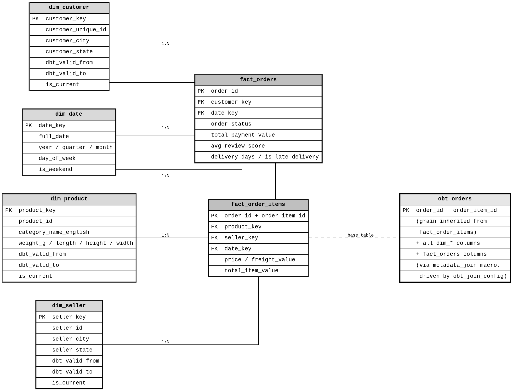
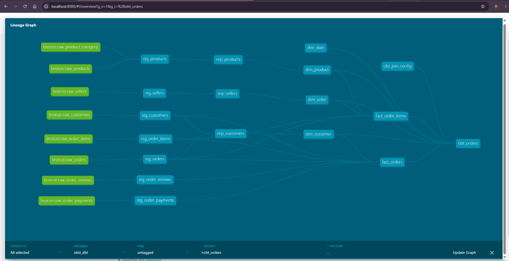
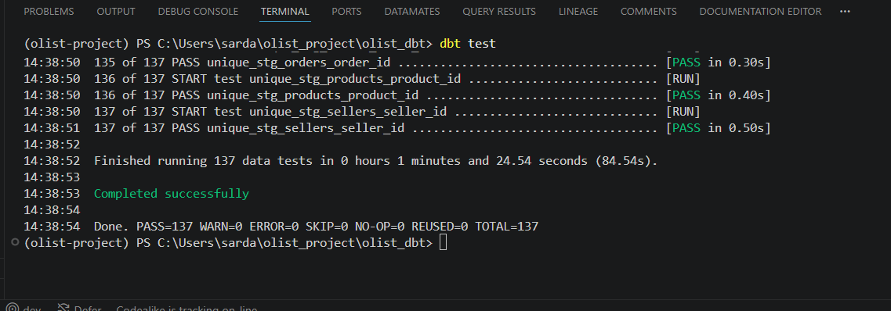
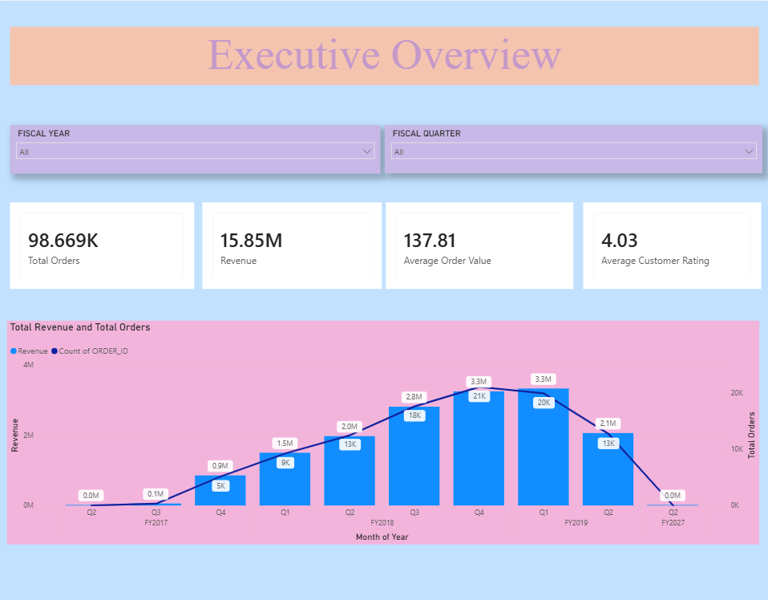
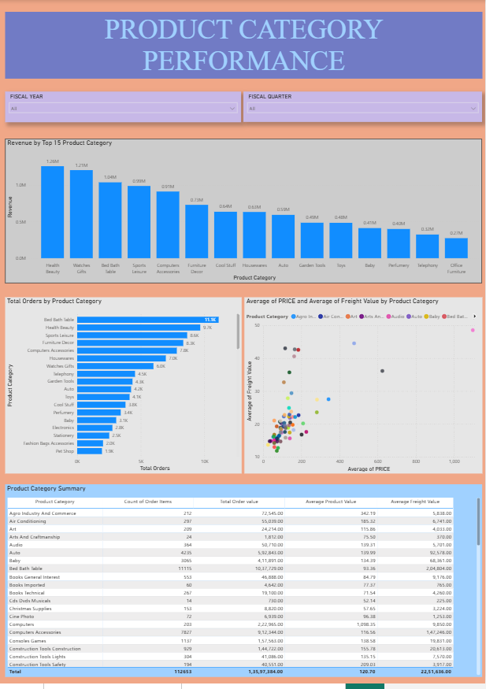
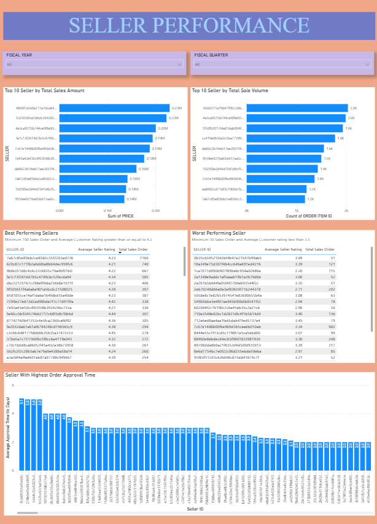
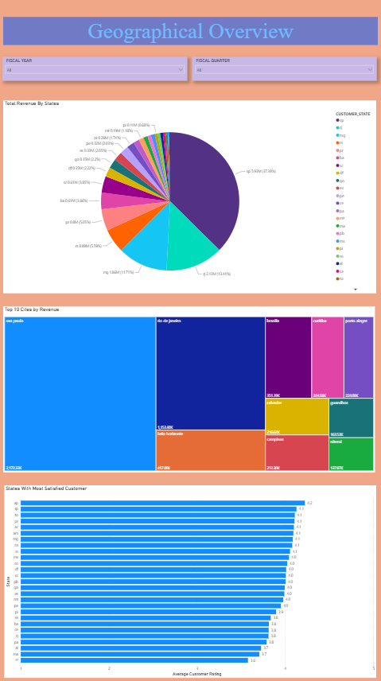

# Olist E-Commerce Data Pipeline — Snowflake + dbt

An end-to-end data engineering project built on the [Olist Brazilian E-Commerce dataset](https://www.kaggle.com/datasets/olistbr/brazilian-ecommerce), implementing a full Medallion Architecture (Bronze → Silver → Gold) on Snowflake, with CDC, SCD Type 2, incremental loading, a metadata-driven One Big Table, role-based access control, and a 137-test data quality framework — all validated through a real incremental/SCD2 simulation, not just a static build.

---

> **A note on this README:** this document is written as a technical narrative and portfolio artifact — it explains the architecture, design decisions, and validated behavior of the pipeline, rather than serving as a setup/installation guide. The project depends on a live Snowflake environment and AWS S3 bucket that are not included or reproducible by cloning this repo alone.

## Table of Contents

1. [Project Overview](#1-project-overview)
2. [Business Objective](#2-business-objective)
3. [Dataset Overview](#3-dataset-overview)
4. [Technology Stack](#4-technology-stack)
5. [Architecture Overview](#5-architecture-overview)
6. [AWS S3 Data Lake Setup](#6-aws-s3-data-lake-setup)
7. [Snowflake Infrastructure](#7-snowflake-infrastructure-built-via-snowsight)
8. [Bronze Layer](#8-bronze-layer)
9. [Silver Layer](#9-silver-layer-dbt)
10. [SCD Type 2 Design](#10-scd-type-2-design)
11. [Gold Layer](#11-gold-layer)
12. [Data Quality & Testing Framework](#12-data-quality--testing-framework)
13. [SCD2 & Incremental Simulation](#13-scd2--incremental-simulation--proof-of-work)
14. [Business Insights Discovered](#14-business-insights-discovered)
15. [Power BI Dashboard](#15-power-bi-dashboard)
16. [Key Design Decisions & Tradeoffs](#16-key-design-decisions--tradeoffs)
17. [Testing in Action — Real Bugs Caught](#17-testing-in-action--real-bugs-caught)
18. [Known Limitations](#18-known-limitations)
19. [Project Structure](#19-project-structure)
20. [Future Improvements](#20-future-improvements)

---

## 1. Project Overview

This project simulates a production-grade analytics pipeline for an e-commerce marketplace. Raw CSV data lands in AWS S3, is ingested into Snowflake via a mix of Snowpipe (event-driven) and COPY INTO (batch), transformed through dbt across Bronze/Silver/Gold layers, and modeled into a star schema with full historical tracking on key dimensions.

The goal was not just to build a working pipeline once, but to **prove it correctly handles change** — new records, updated records, and multi-version dimensional history — through a deliberate, documented simulation exercise.

---

## 2. Business Objective

Build a warehouse capable of answering real business questions without requiring analysts to write complex multi-table joins every time:

- Which product categories generate the most revenue?
- Which states drive the most business, and which have the most satisfied customers?
- What is a seller's average rating, and how does delivery performance vary by region?
- How do returning customers' order patterns change over time?

---

## 3. Dataset Overview

9 source tables from the Olist dataset:

| Table | Description |
|---|---|
| `orders` | Order-level data, status, timestamps |
| `order_items` | Line items per order — product, seller, price, freight |
| `order_payments` | Payment method, installments, value |
| `order_reviews` | Customer satisfaction reviews |
| `customers` | Order-customer bridge — **not** a customer master table (see Design Decisions) |
| `sellers` | Seller location |
| `products` | Product catalog, dimensions, category |
| `product_category_name_translation` | Portuguese → English category lookup |
| `geolocation` | Brazilian zip code → lat/lng mapping |

---

## 4. Technology Stack

| Layer | Tools |
|---|---|
| Storage | AWS S3 |
| Warehouse | Snowflake |
| Transformation | dbt Core (dbt-snowflake) |
| Ingestion | Snowpipe (auto), COPY INTO (batch) |
| CDC | Snowflake Streams + metadata columns (`_source_file`, `_loaded_at`, `_row_hash`) |
| Testing | dbt generic + singular tests, dbt-utils, dbt contracts |
| Version Control | Git / GitHub |
| Environment | Python `uv`, VS Code with dbt Power User |

---

## 5. Architecture Overview

```
S3 (raw CSVs)
    ↓
Snowflake Bronze  ← built via Snowsight SQL (NOT dbt)
    ↓
dbt: Silver → Snapshots → Gold Dims/Facts → OBT
```

**Important distinction — what was built where:**

| Layer | Built with |
|---|---|
| RBAC, warehouses, Storage Integration, Stage, file format, Bronze table DDL, Snowpipe, COPY INTO, Streams | **Snowflake SQL, via Snowsight — not dbt** |
| Silver models, Snapshots, Gold dims/facts, OBT, tests, macros, seeds | **dbt** |

This separation was deliberate: dbt is a transformation tool, not an infrastructure/ingestion tool. Snowflake-native features (Snowpipe, Streams, Storage Integration) have no dbt equivalent and were built directly in Snowflake.

---

## 6. AWS S3 Data Lake Setup

One folder per table:
```
s3://olist-dataset-raj/
├── customers/       ← Snowpipe (transactional — new order-customer rows continuously)
├── sellers/         ← COPY INTO (reference data)
├── products/        ← COPY INTO
├── product_category/← COPY INTO
├── geolocation/      ← COPY INTO
├── orders/          ← Snowpipe
├── order_items/     ← Snowpipe
├── order_payments/  ← Snowpipe
└── order_reviews/   ← Snowpipe
```

**A note on `customers`:** Initially treated as reference data (COPY INTO), but corrected mid-project — since Olist's `customers` table is order-driven (a new row is created per order, not per unique person), it is transactional in nature and was moved to Snowpipe.

**Connection method:** Snowflake connects to S3 via a Stage authenticated with IAM User access keys, entered directly through Snowsight and used to establish the trust between Snowflake and the S3 bucket. (An IAM Role with cross-account `sts:AssumeRole` trust would have been the stronger choice here — it avoids long-lived static credentials entirely, issuing short-lived, auto-rotating tokens instead, which reduces the risk of credentials being exposed.)

---

## 7. Snowflake Infrastructure (Built via Snowsight)

### 7.1 RBAC

Three roles, each scoped to a specific layer:

| Role | Access |
|---|---|
| `LOADER_ROLE` | Full control on Bronze schema only. Owns Storage Integration, Stage, Pipes, Streams. |
| `TRANSFORMER_ROLE` | Read-only on Bronze, full control on Silver/Gold. This is what dbt connects as. |
| `ANALYST_ROLE` | Read-only on Gold only. |

Role creation via `SECURITYADMIN`, database/schema/warehouse objects via `SYSADMIN` — following Snowflake's intended privilege separation.

### 7.2 Warehouses

Three warehouses, isolating compute by workload for cost tracking:
- `LOADING_WH` — ingestion
- `TRANSFORM_WH` — dbt runs
- `ANALYSIS_WH` — BI/analyst queries

### 7.3 CDC Strategy

Two-part CDC approach:
1. **Metadata columns** stamped on every Bronze row at ingestion: `_source_file` (via `METADATA$FILENAME`), `_loaded_at` (default `CURRENT_TIMESTAMP()`), `_row_hash` (MD5 of business columns)
2. **Snowflake Streams** on all 9 Bronze tables, tracking every INSERT for downstream consumption

### 7.4 Ingestion split

- **Snowpipe (event-driven, SQS-triggered)**: `orders`, `order_items`, `order_payments`, `order_reviews`, `customers`
- **COPY INTO (manual/batch)**: `sellers`, `products`, `product_category`, `geolocation`

### 7.5 Infrastructure Scripts

The exact SQL used to build all Snowflake-native infrastructure — RBAC, warehouses, database/schemas, Stage and file format, Bronze table DDL, Snowpipe setup, and Streams — is available in [`snowflake_infrastructure/`](snowflake_infrastructure/).

---

## 8. Bronze Layer

Raw, untransformed data — one table per source file, all columns as `STRING`, plus the 3 CDC metadata columns. No filtering, no casting, no business logic. This is the permanent audit layer.

---

## 9. Silver Layer (dbt)

Cleaned, typed, deduplicated models — one per Bronze table (with `products` absorbing `product_category` via a join).

**Key transformations:**
- `TRY_CAST()` type casting (never hard `CAST`, to avoid failing the whole load on one bad row)
- `clean_string` macro (LOWER + TRIM) on city/state fields
- Typo correction (`product_name_lenght` → `product_name_length`)
- Deduplication via `QUALIFY ROW_NUMBER() ... ORDER BY _loaded_at DESC` on all tables where the same natural key can reappear (critical for correct incremental MERGE behavior — see Challenges section)
- `stg_geolocation` deduplicates many-to-one zip codes via `AVG(lat/lng)` aggregation

**Materialization:** Incremental for every Silver model **except `stg_geolocation`**, which stays `table`. Unlike the other tables, geolocation reference data is static — Brazilian zip codes and their coordinates don't change — so a full rebuild each run is simple and inexpensive, with no incremental logic needed.

**dbt Contracts** (`contract: enforced: true`) are used throughout Silver and Gold — this enforces real column types and `NOT NULL` constraints in the generated Snowflake DDL, since Snowflake itself does not enforce constraints at the engine level by default.

---

## 10. SCD Type 2 Design

Three dimensions carry full history via dbt Snapshots (`check` strategy):

| Snapshot | Natural key | Tracked columns |
|---|---|---|
| `snp_customers` | `customer_unique_id` | city, state, zip |
| `snp_products` | `product_id` | category, weight, length |
| `snp_sellers` | `seller_id` | city, state, zip |

Snapshots read from Silver, deduplicated to one row per natural key (ordered by the customer's most recent order, not ingestion time — see Challenges section for why this matters). Gold dimension tables read from the snapshots and add a surrogate key (`dbt_utils.generate_surrogate_key`) combining the natural key with `dbt_valid_from`.

---

## 11. Gold Layer

### 11.1 Star Schema



### 11.2 Dimensions

| Table | Type | Notes |
|---|---|---|
| `dim_customer` | SCD2 | City/state/zip only — no lat/lng |
| `dim_product` | SCD2 | Category, dimensions |
| `dim_seller` | SCD2 | City/state/zip |
| `dim_location` | Static | Standalone zip → lat/lng, not joined into OBT by default |
| `dim_date` | Generated | Date spine covering 2016–2027 (extended for simulation testing) |

### 11.3 Facts

| Table | Grain | Materialization |
|---|---|---|
| `fact_orders` | One row per order | Incremental |
| `fact_order_items` | One row per order line item | Incremental |

Both join to SCD2 dimensions using a **date-range join** (order date falls within `dbt_valid_from`/`dbt_valid_to`), with a fallback to the current version for orders that predate all snapshot history. See Known Limitations for what this fallback does and doesn't guarantee.

### 11.4 One Big Table (Metadata-Driven)

`obt_orders` is built almost entirely by a single macro call:

```sql
{{ metadata_join('fact_order_items', 'foi') }}
```

`metadata_join` reads `seeds/obt_join_config.csv` at compile time via `run_query()`, and dynamically generates every JOIN clause. **Adding a new dimension to the OBT requires only a new row in the CSV — zero SQL changes.**

## 11.5 Pipeline Lineage



Generated via `dbt docs generate` + `dbt docs serve`, this DAG shows the full dependency chain — from the 9 Bronze sources through Silver staging, SCD2 snapshots, Gold dimensions and facts, into the metadata-driven OBT.

---

## 12. Data Quality & Testing Framework

**137 tests**, spanning:
- Generic tests (`not_null`, `unique`, `accepted_values`, `relationships`) on every model
- Composite uniqueness tests (`dbt_utils.unique_combination_of_columns`) on multi-column grains
- 18 custom singular tests covering:
  - Row count consistency at every layer boundary (Bronze→Silver, Silver→Gold)
  - Fanout detection (duplicate rows from bad joins)
  - SCD2 entity-count checks (distinct natural keys must match across layers, not raw row counts — see Design Decisions)
  - "Exactly one current version" checks per SCD2 entity
  - Aggregate sum consistency between layers
  - Payment/order value mismatch monitoring (threshold-based, not zero-tolerance — see Business Insights)

  

### 12.1 Manual Validation in Snowsight

**Full validation evidence:** beyond the automated test suite, every layer boundary was manually validated with a dedicated set of 25 SQL queries — covering Bronze row counts and metadata, Silver deduplication and cleaning, snapshot version integrity, Gold dimension/fact consistency, OBT correctness, and end-to-end reconciliation from Bronze through to the OBT. Each query is documented with its expected result and a screenshot of the actual output. See the [Olist Validation Document](https://docs.google.com/document/d/1IQo6jVfY88rVX60p1ixkbaNMw-fKnDG1/edit?usp=sharing&ouid=115452149900090949306&rtpof=true&sd=true) for the complete query set and evidence.

---

## 13. SCD2 & Incremental Simulation — Proof of Work

Rather than assume the pipeline handles change correctly, it was proven through a deliberate two-batch simulation:

**Batch 1:** Two new orders uploaded with delivery date left NULL ("in transit"). One order for a returning customer at a new location (triggering SCD2 v2), one for a brand-new customer.

**Batch 2:** The **same two order_ids** re-uploaded with delivery data now filled in — testing that the incremental MERGE updates the existing row rather than duplicating it. Simultaneously, a third version of the same customer's location was added (third order, third address) to prove a 3-deep SCD2 chain, not just a single before/after.

**Result — all verified with live queries:**
- `dim_customer` correctly shows 3 versions for the target customer, with the middle version having both `dbt_valid_from` and `dbt_valid_to` populated
- The two Batch-1 orders show `COUNT(*) = 1` each after Batch 2 — confirmed no duplicate was created
- Total simulated order count after both batches: exactly 3 (not 5) — proving 2 of the 5 uploaded order records were correctly treated as updates
- Zero fanout across the entire `obt_orders` table

*See [Section 3 of the validation document](https://docs.google.com/document/d/1IQo6jVfY88rVX60p1ixkbaNMw-fKnDG1/edit?usp=sharing&ouid=115452149900090949306&rtpof=true&sd=true) (introduced in Section 12) for the complete SQL and result screenshots.*

---

## 14. Business Insights Discovered

**Duplicate `review_id` values across different orders** — investigation revealed this isn't a data bug: the same real customer (`customer_unique_id`) placing multiple orders can have one review linked across multiple `order_id`s, and conversely the same order can receive multiple reviews from a returning customer. The true grain of the reviews table is `review_id + order_id`, not either column alone.

**`total_payment_value` exceeding `total_order_value`** — investigated via a targeted query comparing installment counts between mismatched and overall order populations. Mismatched orders averaged **8.1 installments** vs **3.5** for the overall credit card population — confirming the gap reflects real financing/interest costs on installment purchases, not a pipeline defect.

---

## 15. Power BI Dashboard

A 4-page interactive dashboard built on top of `obt_orders`, turning the pipeline's output into business-consumable KPIs — the same OBT that answers the business questions in Section 2, now visualized.

**Pages:**

| Page | Focus | Key visuals |
|---|---|---|
| Executive Overview | Headline business metrics | Total orders, revenue, average order value, average customer rating; quarterly revenue vs. order volume trend |
| Product Category Performance | Category-level performance | Revenue by top 15 categories, total orders by category, price-vs-freight scatter by category, full category summary table (order count, total value, avg product value, avg freight) |
| Seller Performance | Seller quality, volume, and speed | Top 10 sellers by revenue, top 10 sellers by order volume, best-performing sellers (min. 100 orders, rating ≥ 4.2), worst-performing sellers (min. 50 orders, rating < 3.5), seller-by-seller average order approval time |
| Geographical Overview | Regional performance | Revenue by state, top 10 cities by revenue (treemap), states ranked by average customer satisfaction |

**Build notes:**
- Originally connected live to Snowflake (Import mode, via `ANALYST_ROLE` on `ANALYSIS_WH` — read-only on Gold, matching the RBAC design in Section 7.1). Since the Snowflake trial expires shortly after this project's completion, the data source was switched to a static CSV export of `obt_orders` (see `dashboard_data/`) before publishing, so the dashboard remains fully functional indefinitely, independent of Snowflake access.
- Deduplication logic (e.g. `SUMX(DISTINCT ...)`) was required specifically for order-level measures carried through from `fact_orders` (`total_payment_value`, `avg_review_score`, `delivery_days`) — since `obt_orders` is at item grain, these values repeat across every item belonging to the same order, and a plain `SUM()`/`AVERAGE()` would double-count them. Item-level measures like `price` and `total_item_value` required no such adjustment, since each row's value is already unique to that specific item.
- Minimum order-count thresholds applied to seller and state satisfaction rankings, to avoid small-sample noise skewing results (e.g. a seller with 1 order and a 5-star rating outranking an established seller with hundreds of consistent 4-star orders)
- `product_category_name_english` cleanup (underscore removal, title casing) was added to `stg_products.sql` after noticing raw category labels in the dashboard — a real gap in the original Silver transformation, fixed at the source rather than patched cosmetically in Power BI
- Fiscal Year and Fiscal Quarter slicers on every page, with cross-visual interactions reviewed and selectively disabled where charts answer independent questions (e.g. best vs. worst sellers should not filter each other)

**Two custom DAX measures were required on the Executive Overview page**, since `total_payment_value` and average order value both needed order-level deduplication before aggregating:

```dax
Total Revenue (Payments) = SUMX(DISTINCT('OBT_ORDERS'[ORDER_ID]), CALCULATE(MAX('OBT_ORDERS'[TOTAL_PAYMENT_VALUE])))
```

```dax
Average Order Value = SUM('OBT_ORDERS'[PRICE]) / DISTINCTCOUNT('OBT_ORDERS'[ORDER_ID])
```

**Dashboard file:** [Download the Power BI file (.pbix)](https://drive.google.com/file/d/1p6ipDDbTjutIJ5g5Hz0OjMra8BcgZL1K/view?usp=sharing) — open in Power BI Desktop (free) to explore all 4 pages interactively. Data is imported and cached in the file itself, so it works standalone with no live connection required.

**Underlying data:** the CSV export powering this dashboard is available in [`dashboard_data/`](dashboard_data/) for reference and independent verification.






---

## 16. Key Design Decisions & Tradeoffs

- **`customer_id` vs `customer_unique_id`**: Olist's `customers` table is an order-customer bridge, not a master record — `customer_id` is unique per order, `customer_unique_id` identifies the real person. This distinction shapes the entire customer dimension design.
- **Star schema over snowflake schema**: `dim_customer`/`dim_seller` intentionally keep city/state/zip inline rather than referencing `dim_location`, favoring the star schema's query-simplicity philosophy over normalization.
- **Defensive modeling over silent filtering**: bad/orphaned rows are not silently dropped in Silver; referential integrity is enforced via tests, keeping data quality issues visible rather than hidden.
- **QUALIFY ROW_NUMBER() over correlated NOT EXISTS**: the SCD2 join fallback logic was rewritten from a correlated subquery to a window-function pattern after hitting a genuine Snowflake internal optimizer error at scale — same logical result, more optimizer-friendly execution plan.

---

## 17. Testing in Action — Real Bugs Caught
 
The 137-test suite and the incremental/SCD2 simulation weren't just checkboxes — they surfaced genuine logic errors before they could silently corrupt data:
 
| Bug | How it was caught | Fix |
|---|---|---|
| `is_late_delivery` misclassified undelivered orders as on-time | Manual review of `fact_orders` logic during simulation prep | `NULL > date` evaluates to NULL in SQL, was falling through to `ELSE FALSE`; added explicit `WHEN NULL THEN NULL` branch |
| Fanout risk in SCD2 fact joins | Identified via code review before it could trigger | A date-range join's fallback branch could double-match once real SCD2 history existed; rewrote using `QUALIFY ROW_NUMBER()` ranking instead of a correlated subquery |
| Snowflake internal query execution error (000603) | `dbt run --full-refresh` failed at scale | The correlated `NOT EXISTS` subquery version of the fanout fix hit a genuine Snowflake optimizer limitation; replaced with the `QUALIFY` version, which resolved it |
| Duplicate-row MERGE error during simulation | `dbt run` failed with "duplicate row detected during DML action" | Same `order_id` appeared twice within the incremental lookback window (Batch 1 + Batch 2 of the simulation); added `QUALIFY ROW_NUMBER()` deduplication to all transactional Silver models |
| Missing `dim_date` coverage | `relationships` test failed after uploading simulation data | Date spine only covered 2016–2020 (real data range); simulation used 2026+ dates; extended range to 2016–2027 |
| Customer's "current" address selected by ingestion time, not order recency | Manual investigation of unexpected zip code results in `dim_customer` | Snapshot source was ordered by `_loaded_at` instead of `order_purchase_timestamp`; joined to `stg_orders` and reordered by actual order date |
 
Each of these was found, root-caused, and fixed during development — not left as an open issue.

---

## 18. Known Limitations

**Pre-tracking historical attribution:** SCD2 snapshot tracking began when this project's snapshots were first run (2026), while real Olist order data spans 2016–2020. Orders that predate any snapshot history will always resolve to the *current* dimensional state at query time, not their true historical state, since that history was never captured. This is an inherent, unavoidable limitation of retroactively applying SCD2 to pre-existing historical data — not a pipeline defect. In a live system where SCD2 tracking runs from the point data first enters the system, this limitation would not exist.

---

## 19. Project Structure

```
olist_dbt/
├── models/
│   ├── silver/          # staging models, sources.yml
│   └── gold/
│       ├── dims/
│       ├── facts/
│       └── obt/
├── snapshots/            # SCD2 snapshots
├── macros/                # clean_string, cast_monetary, metadata_join
├── seeds/                 # obt_join_config.csv
├── tests/                 # 18 singular tests
└── dbt_project.yml
```

---

## 20. Future Improvements

- Orchestration (Airflow/Dagster) to automate the run sequence and remove manual `dbt run`/`dbt snapshot` ordering
- CI/CD pipeline to run `dbt test` automatically on every commit
- Environment separation (dev/staging/prod targets)
- Point-in-time attribution improvements for pre-tracking historical orders (acknowledged as fundamentally unrecoverable for truly historical data, but hybrid heuristics could reduce the gap for anything post-simulation)

## Author's Note

This project was built end-to-end, layer by layer, with every architectural decision — RBAC design, ingestion strategy, CDC approach, SCD Type 2 implementation, the metadata-driven OBT — made deliberately and documented as it happened, not retrofitted afterward. The 137-test suite and the two-batch incremental/SCD2 simulation exist because I wanted proof the pipeline handles real change correctly, not just confidence that it built once. Several genuine bugs surfaced during that process — a Snowflake query optimizer limitation, a subtle NULL-handling defect, an incremental MERGE edge case — and each is documented with its root cause and fix, not smoothed over. The Power BI dashboard closes the loop: the same business questions this project set out to answer are now something a stakeholder could actually open and explore.
